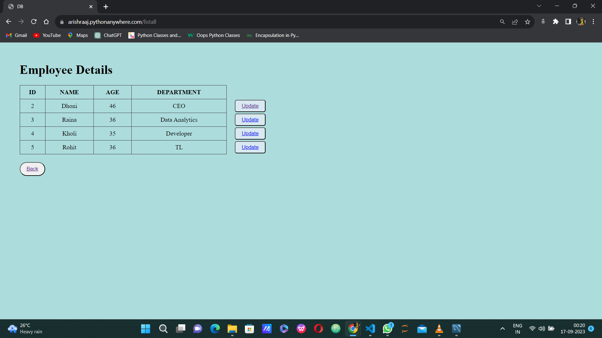

# Employee-Database

Certainly! Below is a sample README file for your Employee Database Management Application:

---

# Employee Database Management Application

This Python Flask application is designed to manage employee data, including their name, age, and department, and store this information in a MySQL database.

## Table of Contents

- [Overview](#overview)
- [Features](#features)
- [Prerequisites](#prerequisites)
- [Screenshots](#screenshots)
- [Contributing](#contributing)

## Overview

The Employee Database Management Application provides a user-friendly interface for managing employee information. Users can perform various actions such as adding, viewing, updating, deleting, and searching for employee data.

## Features

- **Add Employee**: Add new employee details to the database.
- **View Employees**: List all employee details with options to update or delete.
   - **Update Employee**: Edit or change an employee's data in the database.
- **Delete Employee**: Remove an employee and their data from the database.
- **Search Employee**: Find and view an employee's data by entering their name.

## Prerequisites

Before running the application, ensure that you have the following:

- Python installed on your system.
- Flask and MySQL-Python (or a MySQL database connector of your choice) installed via pip.
- A MySQL database set up with the necessary table structure (you can find SQL scripts for table creation in the project).

## Screenshots

## Contributing

Contributions are welcome! Feel free to submit issues and pull requests to help improve the application.

---

Feel free to customize this README file further with additional details or information specific to your project. Provide instructions for setting up the database, configuring the application, and any other relevant information for users and contributors.
